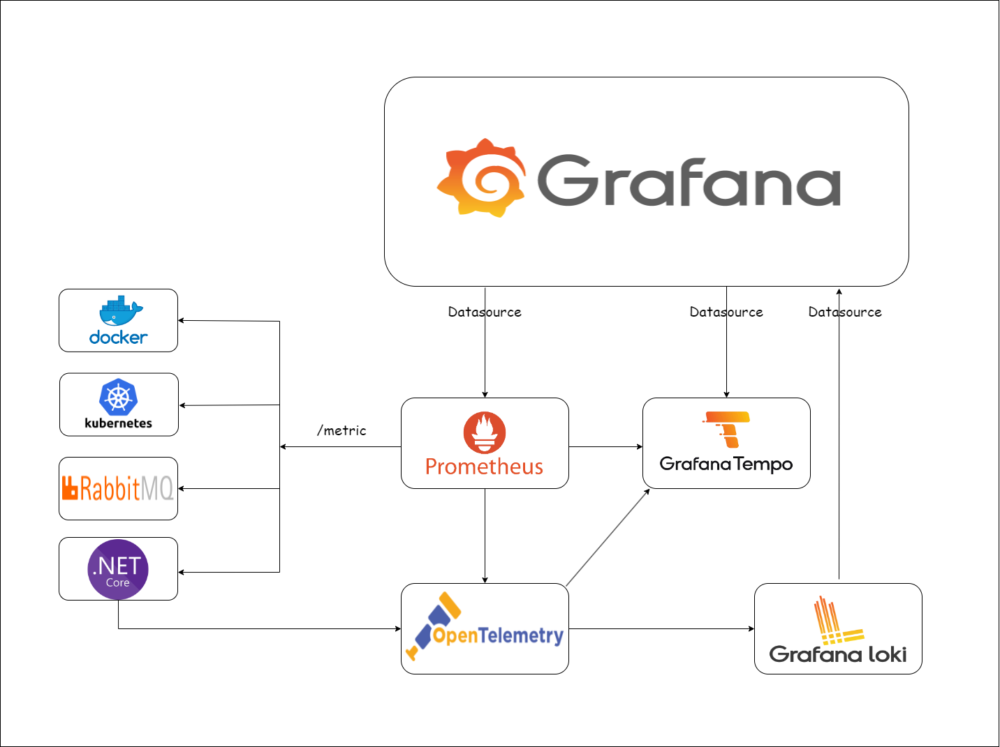

# Web Application Observability and Availability

## Introduction
在分散式架構中有各種不同的服務，包含:
1. Message Queue
2. 各種微服務
3. 各種的Api，如Restful Api、GRPC、GraphQL等

為了能夠追蹤與檢視問題，包含:
1. Api 異常
2. 改進流程
3. 增加安全性
4. 確認需求指標

確保應用程式的可用性，應該要建立可觀察性架構

## Solution Architecture
OpenTelemetry(OTEL) 是近年來最流行的可觀測性框架，提供了標準化的格式和通訊協議(OLTP)，在此解決方案將使用Grafana Tempo 、 Loki等建立可觀察性架構

- OpenTelemetry Collector 是一種用作於收集追蹤及指標的集線器，可以輸出至不同的來源，如 Grafana、Jaeger等
- Prometheus 是一種監控解決方案，用於存儲時間序列數據，例如CPU、Memory等
- Grafana 允許可視化存儲在 Prometheus、Database 等中的數據
- Grafana Tempo  是一個開源、易於使用和大規模分散式跟蹤後端
- Grafana Loki 是一個可擴展、高度可用的多租戶日誌聚合系統


### 下圖顯示了解決方案結構:



## 在本機中運行
### 步驟一
先調整於本儲存庫中configs裡面相對應的設定
1. 調整服務的IP
2. 調整服務的Port

### 步驟二
使用docker compose建立服務
``` shell
docker compose up -d
```

## 建立應用程式服務
這邊以asp net core 8為例

### 安裝套件
- OpenTelemetry.Exporter.Console
- OpenTelemetry.Exporter.OpenTelemetryProtocol
- OpenTelemetry.Exporter.Prometheus.AspNetCore
- OpenTelemetry.Extensions.Hosting
- OpenTelemetry.Instrumentation.AspNetCore
- OpenTelemetry.Instrumentation.Http

:warning: 注意事項
> OpenTelemetry.Exporter.Prometheus.AspNetCore 使用1.8.0會導致
Prometheus收集log錯誤，故需要改為1.7.0 或是使用更新版本

[github 1.8.0 issue](https://github.com/open-telemetry/opentelemetry-dotnet/issues/5506)

### Program.cs
``` csharp
var tracingOtlpEndpoint = "http://otel:4317";
builder.Logging.AddOpenTelemetry(option =>
{
    var resourceBuilder = ResourceBuilder
        .CreateDefault()
        .AddService(builder.Environment.ApplicationName);

    option.SetResourceBuilder(resourceBuilder)
        // ConsoleExporter is used for demo purpose only.
        // In production environment, ConsoleExporter should be replaced with other exporters (e.g. OTLP Exporter).
        .AddConsoleExporter()
        .AddOtlpExporter(o =>
        {
            o.Endpoint = new Uri(tracingOtlpEndpoint);
            o.Protocol = OtlpExportProtocol.Grpc;
        });
});
var otel = builder.Services.AddOpenTelemetry();
otel.ConfigureResource(resource => resource
    .AddService(serviceName: builder.Environment.ApplicationName));
otel.WithMetrics(metrics => metrics
    // Metrics provider from OpenTelemetry
    .AddAspNetCoreInstrumentation()
    .AddMeter(greeterMeter.Name)
    // Metrics provides by ASP.NET Core in .NET 8
    .AddMeter("Microsoft.AspNetCore.Hosting")
    .AddMeter("Microsoft.AspNetCore.Routing")
    .AddMeter("Microsoft.AspNetCore.Diagnostics")
    .AddMeter("Microsoft.AspNetCore.RateLimiting")
    .AddPrometheusExporter());
otel.WithTracing(tracing =>
{
    tracing.AddAspNetCoreInstrumentation(o =>
    {
        o.EnrichWithHttpRequest = (activity, request) =>
        {
            var clientIp = request.Headers["X-Forwarded-For"].FirstOrDefault();
            if (!string.IsNullOrWhiteSpace(clientIp))
            {
                activity.SetTag("http.client.ip", clientIp);
                return;
            }

            var remoteIp = request.HttpContext.Connection.RemoteIpAddress;
            if (remoteIp == null)
            {
                activity.SetTag("http.client.ip", clientIp);
                return;
            }

            clientIp = remoteIp.MapToIPv4().ToString();
            if (clientIp.StartsWith("::ffff:", StringComparison.OrdinalIgnoreCase))
            {
                activity.SetTag("http.client.ip", clientIp.ToLower().Replace("::ffff:", ""));
            }
        };
    });
    tracing.AddHttpClientInstrumentation();
    tracing.AddSource(TracingActivitySource.WebApiRegisteredActivity.Name);
    tracing.AddSource(TracingActivitySource.ServiceRegisteredActivity.Name);
    tracing.AddSource(TracingActivitySource.RepositoryRegisteredActivity.Name);
    if (tracingOtlpEndpoint != null)
    {
        //tracing.AddConsoleExporter();
        tracing.AddOtlpExporter(otlpOptions =>
        {
            otlpOptions.Endpoint = new Uri(tracingOtlpEndpoint);
            otlpOptions.Protocol = OtlpExportProtocol.Grpc;
        });
    }
    else
    {
        tracing.AddConsoleExporter();
    }
});
```

### 建立指標
``` csharp
var greeterMeter = new Meter("Monitor.Sample", "1.0.0");
var countGreetings = greeterMeter.CreateCounter<int>("greetings.count", description: "Counts the number of greetings");
```

### 建立追蹤
``` csharp
public static class TracingActivitySource
{
    public static readonly ActivitySource WebApiRegisteredActivity = new("Monitor.Sample.Api", "1.0.0");
    public static readonly ActivitySource ServiceRegisteredActivity = new("Monitor.Sample.Service", "1.0.0");
    public static readonly ActivitySource RepositoryRegisteredActivity = new("Monitor.Sample.Repository", "1.0.0");
}
```

``` csharp
    public Task<int> GetNumberAsync()
    {
        
        var stepName = $"{nameof(TracingTestService)}.{nameof(GetNumberAsync)}";
        using (TracingActivitySource.ServiceRegisteredActivity.StartActivity(stepName))
        {
            return tracingTestRepository.GetNumberAsync();
        }
    }
```

## 參考連結
[grafana cadvisor-exporter dashboard](https://grafana.com/grafana/dashboards/14282-cadvisor-exporter/)

[grafana dotnet 8 dashboard](https://grafana.com/grafana/dashboards/19924-asp-net-core/)

[grafana opentelemetry](https://grafana.com/grafana/dashboards/15983-opentelemetry-collector/)
[grafana dotnet 8 source code](https://github.com/dotnet/aspire/tree/main/src/Grafana)

[dotnet 8 metric](https://learn.microsoft.com/zh-tw/dotnet/core/diagnostics/built-in-metrics-aspnetcore#microsoftaspnetcorerouting)

[dotnet 8 自訂metric](https://learn.microsoft.com/zh-tw/dotnet/core/diagnostics/metrics-instrumentation?source=recommendations)

[prometheus+grafana](https://www.cnblogs.com/qdhxhz/p/16325893.html)

[Grafana loki](https://github.com/grafana/loki/blob/main/examples/getting-started/docker-compose.yaml)

[dotnet logger in otel](https://github.com/open-telemetry/opentelemetry-dotnet/blob/main/docs/logs/getting-started-aspnetcore/Program.cs)
